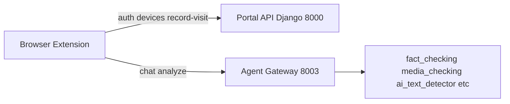

# s-island

**A safe island for your child—amid a sea of harmful content.**

s-island helps families keep kids safe online with real-time protection, parental control (whitelist/blacklist), and optional AI-powered checks—without spying on private messages. Parents get clear risk summaries and device management; children keep their privacy.

This repo (hte) contains the web app, backend, Chrome extension, and optional AI services.

---

## What's in this repo

| Part | Description |
|------|-------------|
| **Frontend** (`frontend/`) | Next.js app: landing page, login/register, about, **parents portal** at `/portal` (devices, visited sites, whitelist/blacklist, dashboard). |
| **Backend** (`backend/`) | Django + PostgreSQL: portal API (auth, validate, devices, whitelist/blacklist, visited-sites, record-visit, dashboard). |
| **Extension** (`extension/`) | Chrome extension (Manifest V3): **Control** mode (blocking) and **Agent** mode (ask "Is this real?" / "AI-generated?"). Config: `config.js` (local), `config.aws.js` (after AWS deploy). Same emerald/s-island theme as the web app. |
| **Agent gateway** (`backend/services/agent_gateway`) | FastAPI service for extension Agent mode (chat/analyze); runs on port **8003**; used by the extension. Standalone `gateway/` exists for local use but is secondary; default setup uses agent_gateway on 8003. |
| **Backend services** (`backend/services/`) | Optional microservices for full AI flows. Run via `backend/services/docker-compose.yml`. Ports: **agent_gateway** 8003, **fact_checking** 8001, **ai_text_detector** 8002, **info_graph** 8004, **content_safety** 8005, **media_explanation** 8006, **media_checking** 8007. |

---

## Prerequisites

- **Node.js** — for the frontend
- **Python 3.x** — for Django and backend services
- **Docker** — for PostgreSQL and optional backend services
- **Chrome** — for loading the extension

---

## Quick start

All paths below are from the **repo root**.

### 1. Database (PostgreSQL)

```bash
cd backend
cp .env.example .env
# Edit .env if you want a different POSTGRES_PASSWORD

docker compose up -d
```

### 2. Backend (Django)

```bash
cd backend
python3 -m venv .venv
source .venv/bin/activate   # Windows: .venv\Scripts\activate
pip install -r requirements.txt
python manage.py migrate
python manage.py runserver
```

- API: **http://127.0.0.1:8000/api/portal/**
- Admin: **http://127.0.0.1:8000/admin/** (create a superuser with `createsuperuser` if needed)

### 3. Frontend (Next.js)

```bash
cd frontend
npm install
npm run dev
```

- App: **http://localhost:3000**  
  (Landing, login, register, about, parents portal at `/portal`.)
- Set `NEXT_PUBLIC_API_URL` to the Portal API URL when not using the default.

### 4. Extension (Chrome)

1. Get an API key from the parents portal (add a device, copy its API key).
2. Open **Chrome** → `chrome://extensions/` → **Developer mode** → **Load unpacked** → select the `extension` folder.
3. Click the extension icon → **Open extension options** → paste the API key → **Save and validate**.

The extension uses **127.0.0.1** in `extension/config.js` (Portal 8000, Gateway 8003) so it can reach Django on machines where `localhost` is IPv6. After an AWS deploy, `extension/config.aws.js` is generated with the public Portal and Gateway URLs.

### 5. Gateway (optional, for Agent mode)

If you use Agent mode ("Is this real?" / "AI-generated?"), run the **agent_gateway** on port 8003.

- **Option A (recommended)** — via Docker:

  ```bash
  cd backend/services
  cp agent_gateway/.env.example agent_gateway/.env
  docker compose up -d agent_gateway
  ```

- **Option B** — standalone for local dev:

  ```bash
  cd backend/services/agent_gateway
  python3 -m venv .venv
  source .venv/bin/activate   # Windows: .venv\Scripts\activate
  pip install -r requirements.txt
  # Create .env from .env.example, set PORTAL base URL if needed
  uvicorn app.main:app --host 0.0.0.0 --port 8003 --reload
  ```

`extension/config.js` already points to `http://127.0.0.1:8003` for the gateway.

### 6. Optional: All backend services (Docker)

To run all AI services (fact_checking, media_checking, ai_text_detector, info_graph, content_safety, media_explanation, agent_gateway):

```bash
cd backend/services
# Create .env from .env.example in each service dir as needed
docker compose up -d
```

Note: the compose file maps **media_checking** to host port 8000 (container 8007). If you run this while also running Django, either run Django on a different port or change the compose port mapping so it does not conflict.

### 7. Optional: AWS deployment

For production deployment: see [scripts/README.md](scripts/README.md).

- Prerequisites: Python, Docker, AWS credentials.
- From repo root: `python scripts/aws_deploy.py --region us-east-1`
- The script provisions infra (CloudFormation: VPC, RDS, ECR, ECS, ALBs), builds/pushes images, deploys services, and writes `extension/config.aws.js` with the public Portal and Gateway URLs.

---

## Project structure

```
hte/
├── frontend/          # Next.js (App Router), Tailwind, s-island theme
├── backend/           # Django + portal app, PostgreSQL
│   ├── portal/        # API: auth, validate, devices, whitelist/blacklist, visited-sites, record-visit, dashboard
│   └── services/      # Optional: agent_gateway, fact_checking, media_checking, ai_text_detector, info_graph, content_safety, media_explanation
├── extension/         # Chrome extension (popup, options, blocked page)
├── gateway/           # Optional standalone FastAPI gateway (alternative to backend/services/agent_gateway)
├── infra/             # CloudFormation (VPC, RDS, ECR, ECS, ALBs)
├── scripts/           # AWS deploy script and env loader
└── README.md
```

---

## Features

- **Landing & branding**: s-island tagline, benefits, reviews carousel, Outfit + DM Sans.
- **Parents portal**: Auth (validate, login/register), devices with types (control/agentic), per-device whitelist/blacklist with suggested lists, visited sites with flags (harmful content, personal info leak, predators), visit detail modal, dashboard; no Google search in visited list.
- **Extension**: Control mode (blocking by blacklist) and Agent mode (chat/analyze with gateway). API key from portal (device UUID + type suffix). Agent: optional Ollama for content extraction; keyword and PII detection (local). Config: `config.js` (local), `config.aws.js` (after AWS deploy).
- **Backend**: Record visits from extension; filter Google from visited list; validate API keys; dashboard; device and list management.
- **Backend services (optional)**: agent_gateway (orchestrator for Agent mode), fact_checking, media_checking, ai_text_detector, info_graph, content_safety, media_explanation — used for full AI pipelines.

---

## Architecture (high level)



---

## Docs in subfolders

- **Backend**: [backend/README.md](backend/README.md) — Django setup, Docker Postgres, portal API.
- **Frontend**: [frontend/README.md](frontend/README.md) — Next.js dev and deploy.
- **Extension**: [extension/README.md](extension/README.md) — API key, Agent/Control mode, loading in Chrome, config.
- **Gateway**: [gateway/README.md](gateway/README.md) — Standalone gateway endpoints and env.
- **Scripts (AWS)**: [scripts/README.md](scripts/README.md) — Deploy to AWS, credentials, env handling.

---

## Tech stack

- **Frontend**: Next.js 16, React 19, Tailwind CSS 4, TypeScript.
- **Backend**: Django 5, PostgreSQL, django-cors-headers.
- **Extension**: Vanilla JS, Manifest V3, Chrome APIs.
- **Gateway / services**: FastAPI (Python).

---

## License

Proprietary / internal use unless otherwise stated.
